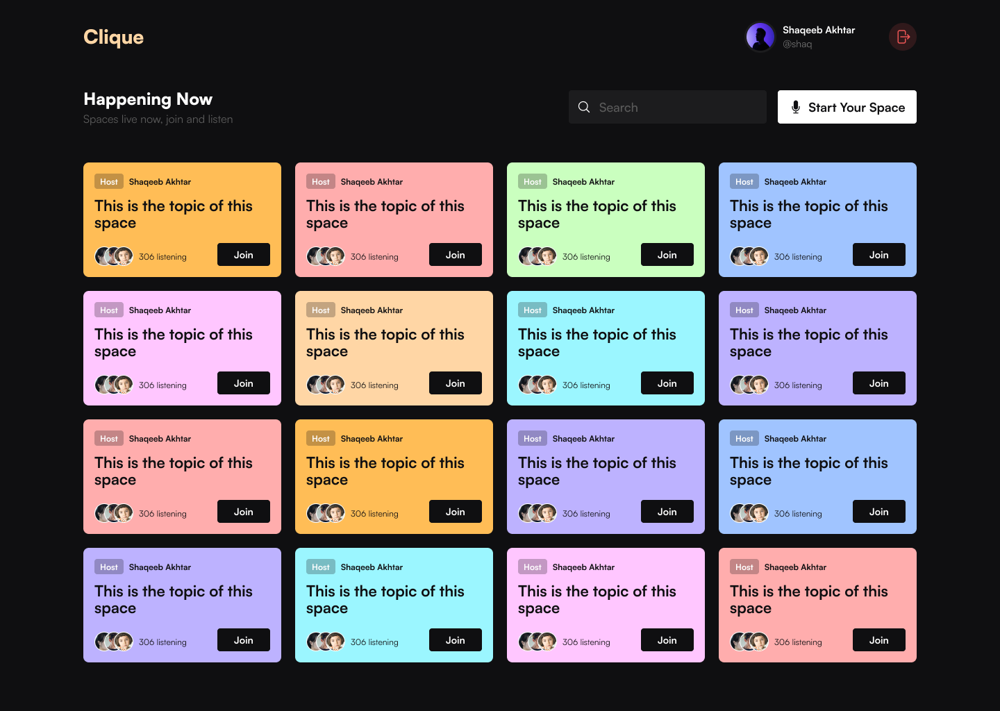
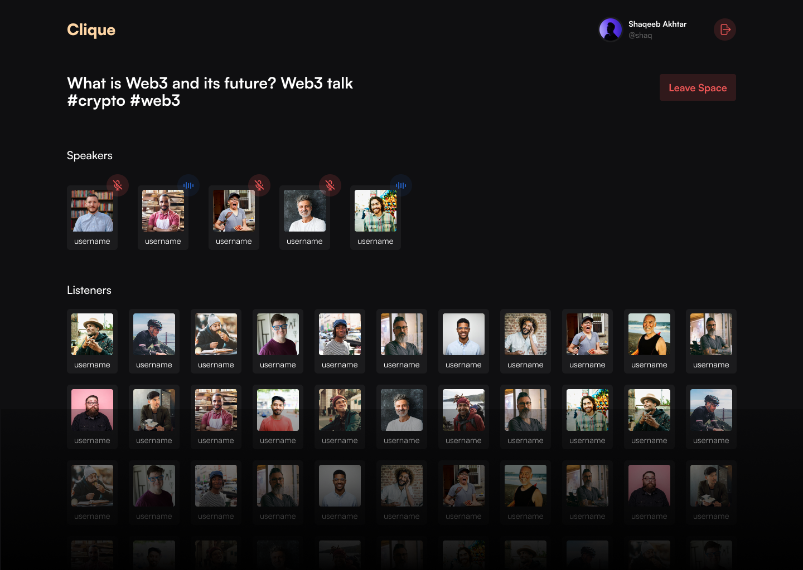

# Clique Backend

Welcome to the Clique backend repository! built with NodeJS, Express, JavaScript, MongoDB, and Socket.IO. In this document, you will find detailed information about the project, and guidelines for contributing to this project.

Please note that the frontend and backend repositories are separate. If you're looking for the **frontend repository**, you can find it [here](https://github.com/shaqeebakhtar/clique).

## Table of Contents

- [Project Overview](#project-overview)
- [Screenshots](#screenshots)
- [Features](#features)
- [Technologies Used](#technologies-used)
- [Getting Started](#getting-started)
  - [Environment Variables](#environmental-variables)
  - [Installation](#installation)
- [Roadmap](#roadmap)
- [Contribution Guidelines](#contribution-guidelines)
  - [Creating an Issue](#creating-an-issue)
  - [Working on an Issue](#working-on-an-issue)
  - [Commit Guidelines](#commit-guidelines)
  - [Pull Requests](#pull-requests)
- [Contact](#contact)

## Project Overview

Clique is a platform where users can host/join live audio conversations with others on various topics similar to Twitter spaces. The backend of the project is built using NodeJS, Express, JavaScript, MongoDB, and Socket.IO.

## Screenshots





## Features

- **Live audio conversation:** Users can host and participate in live audio conversations with others on various topics.

## Technologies Used

The backend of the Clique is built using the following technologies:

- NodeJS
- Express
- JavaScript
- MongoDB
- Socket.IO

## Getting Started

To get started with the Clique backend project, follow the instructions below.

### Environmental Variables

To run this project, you will need to add the following environment variables to your .env file

```
HASH_SECRET=secret

TWILIO_SMS_SID=secret

TWILIO_AUTH_TOKEN=secret

SMS_FROM_NUMBER=123456789

MONGO_URL=

JWT_ACCESS_TOKEN_SECRET=secret

JWT_REFRESH_TOKEN_SECRET=secret

BASE_URL=http://localhost:5500
```

### Installation

1. Clone the repository to your local machine:

   ```bash
   git clone https://github.com/shaqeebakhtar/clique-api.git
   ```

2. Navigate to the project directory:

   ```bash
   cd clique
   ```

3. Install the dependencies:

   ```bash
   npm install
   ```

4. Start Development Server

   To start the development server, use the following command:

   ```bash
   npm run dev
   ```

This will start the backend application and it will be accessible at [http://localhost:5500](http://localhost:5500).

## Roadmap

- Add moderation - Hosts can have the ability to mute, remove, and add anyone as a speaker.

- Users can request to be a speaker.

- Ability to create spaces as public, private, and unlisted.

## Contribution Guidelines

We welcome contributions from the community to make Clique better. If you would like to contribute, please follow the guidelines below.

### Creating an Issue

If you have found a bug, have a feature request, or want to suggest an improvement, you can create an issue on the GitHub repository. Please provide a clear and detailed description of the issue or suggestion.

### Working on an Issue

If you want to work on an existing issue, please follow these steps:

1. Comment on the issue that you want to work on it, to let others know that you're working on it.

2. Fork the repository to your own GitHub account.

3. Create a new branch for your contribution:

   ```bash
   git checkout -b my-contribution
   ```

4. Make your changes and commit them with appropriate messages following the [commit guidelines](#commit-guidelines).

5. Push your changes to your forked repository:

   ```bash
   git push origin my-contribution
   ```

6. Create a pull request from your forked repository to the main repository's `main` branch.

### Commit Guidelines

I want you to follow the [Conventional Commit Types](https://github.com/pvdlg/conventional-commit-types) guidelines for commit messages. This helps to maintain a consistent commit history and makes it easier to understand the changes made in each commit.

Please use the following format for your commit messages:

```
<type>: <description>
```

Example commit messages:

```
feat: Add user authentication endpoints

chore: Update dependencies

docs: Update README with contribution guidelines

refactor: Rename variables for better readability
```

### Pull Requests

To submit your changes for review, create a pull request with the following information:

- Provide a clear and descriptive title for your pull request.
- Include a summary of the changes you have made.
- Reference any related issues using the GitHub issue number.

## Contact

If you have any questions or need further assistance, you can reach out to the me:

- Name: Shaqeeb Akhtar
  - Email: [shaqeebakhtar01@gmail.com]
  - Twitter: [shaqeeb_akhtar](https://twitter.com/shaqeeb_akhtar)

Thank you for your interest in contributing to Clique! We appreciate your support.
